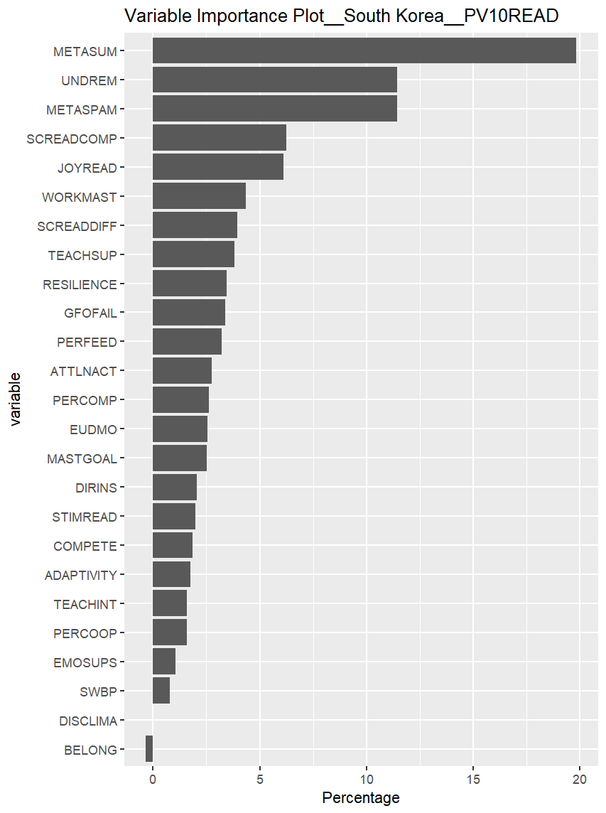

# PISA 2018 - RandomForest
This repository is Python & R scripts for running randomForest analysis with PISA2018 data.<br/>
The analysis focuses particularly on the population of South Korea and the U.S.
The dependent variable in this analysis is `academic resilience` which related to academic achievement and ESCS(Economic, Social, and Cultural Status).

## Prerequisite
- program version
    - python 3.8.18
    - r 4.2.2
- requirements
    - install dependency package
        - ```pip install -r requirements.txt```
    - PISA 2018 dataset(only student, school, teacher), you can download from here ([PISA2018 database](https://www.oecd.org/pisa/data/2018database/))
    - write list of variables to `codebook.xlsx`. [[Note: PISA Codebook](https://www.oecd.org/pisa/data/2018database/)], [Note: see also `codebook(sample).xlsx`]
    - this project is developed as module, Run the shell command to add project directory to the Python path
        - for powershell,
            ```
            ./init_env.ps1
            ```
        - for other OS, you can just add repository directory to `sys.path`


## Run Analysis
### 1. Load and Explore data
- this part is conducted by Python
- enter repository directory on shell
- unzip data file, slice it and convert to pickle
```
python main.py --load
```
- preprocessing and explore for one PV (`--visualize` argument is optional)
```
python main.py --eda --PV 1 --visualize
```

- preprocessing and explore for all PVs
- after running this code, you can get 10 excel files and bunch of visualization results
```
python main.py --eda --loop --visualization
```

### 2. Run RandomForest analysis
- this part is conducted by R scripts named `Analysis.r`
- these functions are mainly implemented below..
    1. run RF 1 time for one PV
    2. run RF 5 times for one PV
    3. run RF 1 times for 10 PVs

## Expected Result
- descriptive statistics
- confusion matrix of each RF model
- variable importance plot

- compare 10 results of analysis